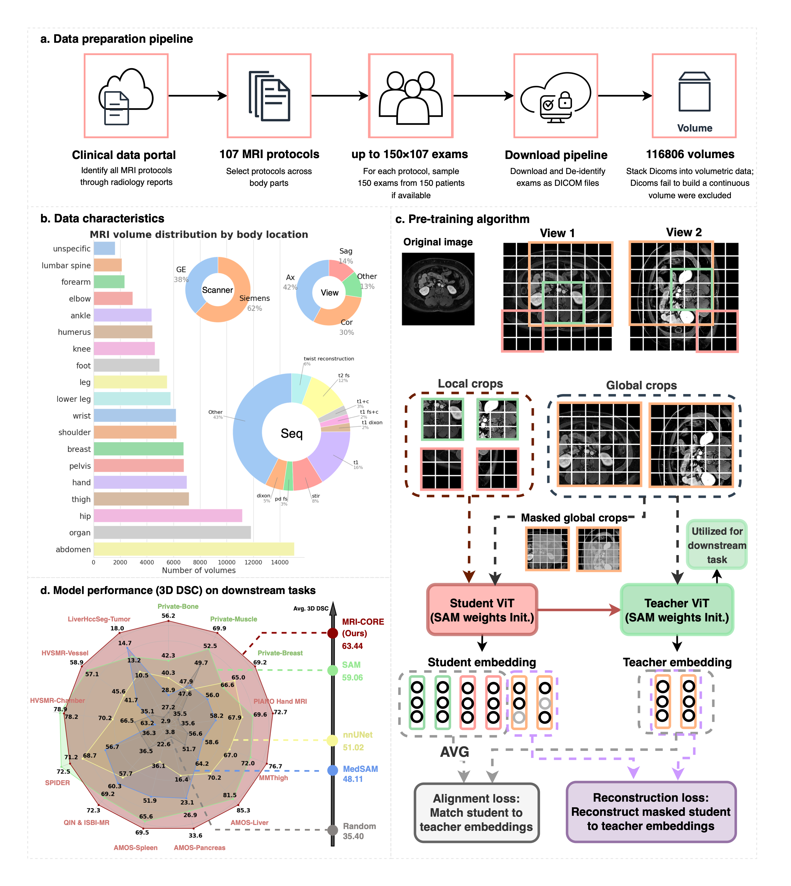

# MRI-CORE: A New Foundation Model for MRI

Authors: [Haoyu Dong](https://scholar.google.com/citations?user=eZVEUCIAAAAJ&hl=en), [Yuwen Chen](https://scholar.google.com/citations?user=61s49p0AAAAJ&hl=en), [Hanxue Gu](https://scholar.google.com/citations?hl=en&user=aGjCpQUAAAAJ&view_op=list_works&sortby=pubdate), [Nicholas Konz](https://scholar.google.com/citations?user=a9rXidMAAAAJ&hl=en), [Yaqian Chen](https://scholar.google.com/citations?user=iegKFuQAAAAJ&hl=en), [Qihang Li](https://scholar.google.com/citations?user=Yw9_kMQAAAAJ&hl=en), [Maciej A. Mazurowski](https://scholar.google.com/citations?user=HlxjJPQAAAAJ&hl=zh-CN)

This is the official code for our paper: [MRI-CORE: A Foundation Model for Magnetic Resonance Imaging](https://arxiv.org/abs/2404.09957), where we propose a new foundation model designed specifically for MRI. Figure 1 shows the overview of this model, including training data, training algorithm, and performance on the few-shot segmentation task. 



We demonstrate the superior performance of MRI-CORE on few-shot segmentation, linear probing and zero-shot segmentation on various tasks and datasets.


## Model
The model's weights can be accessed [here](https://drive.google.com/file/d/1nPkTI3H0vsujlzwY8jxjKwAbOCTJv4yW/view?usp=sharing).

## How to use
### Image preprocessing
Apply slice-wise normalization to [0, 1].

### Load model
To load the segmentation model with pre-trained weights, check this code snippet:
```
from models.sam import sam_model_registry  
import cfg

args = cfg.parse_args()
model = sam_model_registry['vit_b'](args, checkpint="PATH_TO_CHECKPOINT", num_classes=args.num_cls, image_size=args.image_size, pretrained_sam=True)
```

### Forward pass
```
# Forward
img_emb = model.image_encoder(imgs)
sparse_emb, dense_emb = model.prompt_encoder(points=None, boxes=None, masks=None)
pred, _ = model.mask_decoder(image_embeddings=img_emb,                                                              
                             image_pe=sam.prompt_encoder.get_dense_pe(),                                            
                             sparse_prompt_embeddings=sparse_emb,                                                   
                             dense_prompt_embeddings=dense_emb,                                                     
                             multimask_output=True)
```
