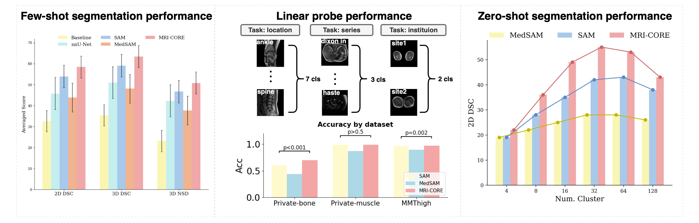

# MRI-CORE: A Foundation Model for MRI

Authors: [Haoyu Dong](https://scholar.google.com/citations?user=eZVEUCIAAAAJ&hl=en), [Yuwen Chen](https://scholar.google.com/citations?user=61s49p0AAAAJ&hl=en), [Hanxue Gu](https://scholar.google.com/citations?hl=en&user=aGjCpQUAAAAJ&view_op=list_works&sortby=pubdate), [Nicholas Konz](https://scholar.google.com/citations?user=a9rXidMAAAAJ&hl=en), [Yaqian Chen](https://scholar.google.com/citations?user=iegKFuQAAAAJ&hl=en), [Qihang Li](https://scholar.google.com/citations?user=Yw9_kMQAAAAJ&hl=en), [Maciej A. Mazurowski](https://scholar.google.com/citations?user=HlxjJPQAAAAJ&hl=zh-CN)

This is the official code for our paper: **[MRI-CORE: A Foundation Model for Magnetic Resonance Imaging](https://arxiv.org/abs/2404.09957)**, where we propose a new foundation model designed specifically for MRI.

Figure 1 provides an overview of MRI-CORE, including training data, training algorithm, and performance on the few-shot segmentation task:


MRI-CORE achieves strong performance across few-shot segmentation, linear probing, and zero-shot segmentation on multiple datasets:



---

## 📖 Citation

If you find our work useful, please cite:

```bibtex
@article{dong2024mricore,
  title={MRI-CORE: A Foundation Model for Magnetic Resonance Imaging},
  author={Dong, Haoyu and Chen, Yuwen and Gu, Hanxue and Konz, Nicholas and Chen, Yaqian and Li, Qihang and Mazurowski, Maciej A},
  journal={arXiv preprint arXiv:2404.09957},
  year={2024}
}
```

---

## ⚙️ Installation (Step 0)

We recommend creating a fresh conda environment and installing the required dependencies:

```bash
# Create environment
conda create --name myenv python=3.12
conda activate myenv

# Install PyTorch with CUDA 12.4
pip install torch==2.6.0 torchvision==0.21.0 torchaudio==2.6.0 --index-url https://download.pytorch.org/whl/cu124

# Install other dependencies
pip install -r requirements.txt
```

> **Note:** If you have a different CUDA version, please adjust the PyTorch index URL accordingly (see the official PyTorch website for the correct wheel).
> 
## 📥 Download Pre-Trained Models (Step 1)

- MRI-CORE checkpoint: **[Download here](https://drive.google.com/file/d/1nPkTI3H0vsujlzwY8jxjKwAbOCTJv4yW/view?usp=sharing)**
- *(Optional)* SAM weights (for few-shot segmentation): **[Download here](https://dl.fbaipublicfiles.com/segment_anything/sam_vit_b_01ec64.pth)**

After downloading, place the checkpoints inside the `pretrained_weights/` directory.

## 🔍 Extract Features with MRI-CORE (Step 2)

Example code to load the model and extract image embeddings:

```python
from models.sam import sam_model_registry
import cfg

args = cfg.parse_args()
# Disable adapters when using the model only for feature extraction (no fine-tuning)
args.if_encoder_adapter = False
args.if_mask_decoder_adapter = False

model = sam_model_registry['vit_b'](
    args,
    checkpoint="PATH_TO_CHECKPOINT",
    num_classes=args.num_cls,
    image_size=args.image_size,
    pretrained_sam=False
)

# imgs should be a FloatTensor normalized to [0, 1]
# shape: [B, C, H, W]
img_emb = model.image_encoder(imgs)
```

## 🩻 Run Segmentation (Step 3 & Step 4)

### Step 3 — Dataset Preprocessing

Since MRI-CORE is based on SAM (a 2D model), all MRI volumes must be sliced into 2D images. Normalize each slice to the range `[0, 1]`.

Expected directory structure:

```
datasets/
  ├── images/        # 2D slices
  ├── masks/         # segmentation masks
  ├── train.txt
  ├── val.txt
  └── test.txt
```

We provide an example of a pre-processed dataset **[here](https://drive.google.com/file/d/1oWoVGdwXwNTVr1oTLV_dRDGEJZyKJLnJ/view?usp=sharing)**. For more details on the dataset, see the **[original repository](https://github.com/Hirriririir/Multimodal-Multiethnic-Thigh-Muscle-MRI-analysis)**.

### Step 4 — Few-Shot Segmentation

Once the dataset is prepared, you can run few-shot segmentation with the provided training script (example):

```bash
python main.py   --img_folder datasets/images   --mask_folder datasets/masks   --train_img_list datasets/train.txt   --val_img_list datasets/val.txt   --test_img_list datasets/test.txt   --n_type slice_norm   --image_size 1024   --b 4   --num_cls 1   --checkpoint pretrained_weights/MRI_CORE_vitb.pth
```

> Adjust arguments (batch size, image size, normalization type, etc.) to your environment and dataset.

## 💡 Minimal Inference Example

```python
import torch
from models.sam import sam_model_registry
import cfg

# 1) Load args and model
args = cfg.parse_args()
model = sam_model_registry['vit_b'](
    args,
    checkpoint="pretrained_weights/MRI_CORE_vitb.pth",
    num_classes=1,
    image_size=1024,
    pretrained_sam=True
).eval().cuda()

# 2) Prepare input (B, C, H, W), normalized to [0, 1]
imgs = torch.randn(1, 3, 1024, 1024, device="cuda")  # replace with your preprocessed image tensor

# 3) Forward pass
img_emb = model.image_encoder(imgs)
sparse_emb, dense_emb = model.prompt_encoder(points=None, boxes=None, masks=None)
pred, _ = model.mask_decoder(
    image_embeddings=img_emb,
    image_pe=model.prompt_encoder.get_dense_pe(),
    sparse_prompt_embeddings=sparse_emb,
    dense_prompt_embeddings=dense_emb,
    multimask_output=True
)
```

---

## 📜 License

The code and models are released under the **[Apache 2.0 License](./LICENSE)**.
